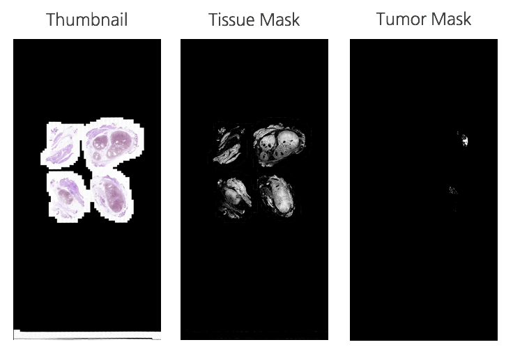
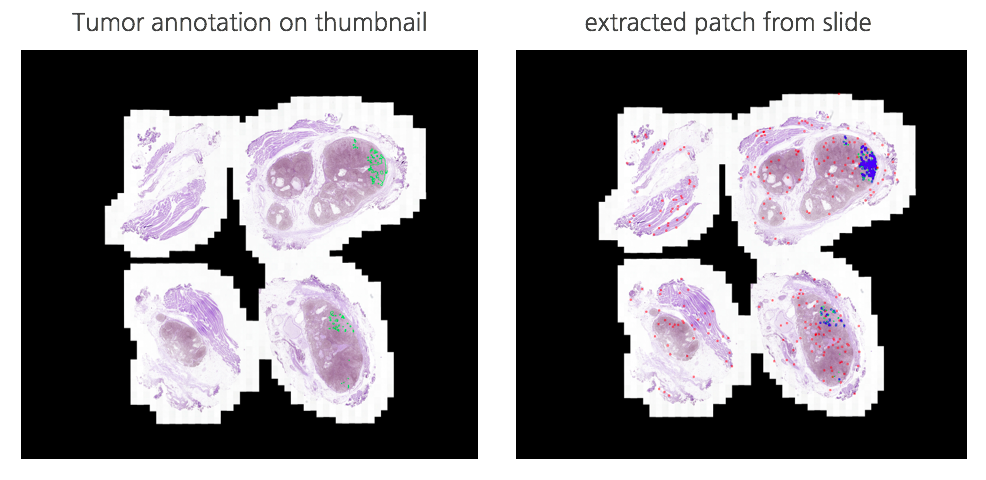
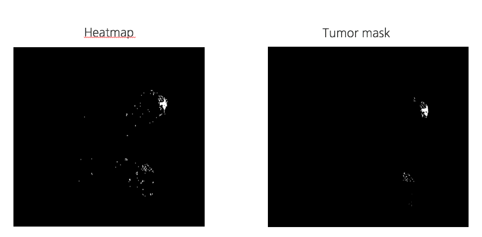
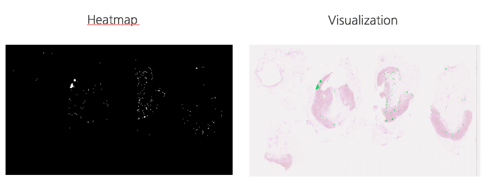
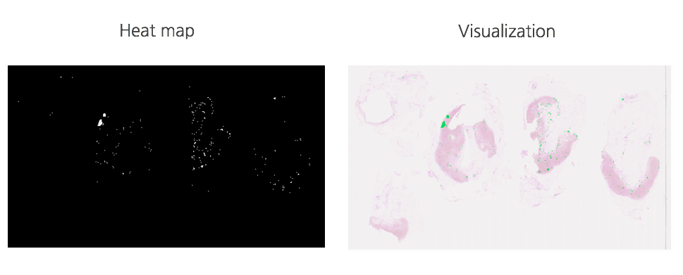

# CamelyonTask

The CAMELYON17 challenge is still open for submissions!

Built on the success of its predecessor, CAMELYON17 is the second grand challenge in pathology organised by the Diagnostic Image Analysis Group (DIAG) and Department of Pathology of the Radboud University Medical Center (Radboudumc) in Nijmegen, The Netherlands.

The goal of this challenge is to evaluate new and existing algorithms for automated detection and classification of breast cancer metastases in whole-slide images of histological lymph node sections. This task has high clinical relevance and would normally require extensive microscopic assessment by pathologists. The presence of metastases in lymph nodes has therapeutic implications for breast cancer patients. Therefore, an automated solution would hold great promise to reduce the workload of pathologists while at the same time reduce the subjectivity in diagnosis.

## Requirements
    * python == 3.6
    * pytorch >= 0.3
    * Numpy

## Background
    * To see what whole-slide images of breast cancer, check the [CAMELYON17/background]( https://camelyon17.grand-challenge.org/background/)

## Data
    * The data in this challenge contains whole-slide images (WSI) of hematoxylin and eosin (H&E) stained lymph node sections.
    * The whole-slide images provided in this challenge are standard TIFF files.
    * This project use some of them.
    * (we does not disclose them. if you want to run this code, you need to get some example data from CAMELYON17)

## File description (...editing)
    * 'create_dataset.py' create dataset consist of patch data (304 X 304 numpy array) and label array is composed of label data for each of them. label contains indicator determine patch has tumor part.
    * 'load_dataset.py'
    * 'train.py'
    * 'eval.py'
    * 'user_define.py'

    * 'prepro_for_test2'
    * 'create_heatmap_from_csv.py'
    * 'do_visualize.py'
    * 'logger.py'
    * 'utils.py'

## Model(...editing)

## Training
    * STEP 1. Check 'user_define.py' values
    * STEP 2. Run 'python create_dataset.py'
    * STEP 3. Run 'python train.py'

## Test
    * Run 'python eval.py'

## Evaluation Metric
    * (editing - Should contain Recall, Precision value)
    * ROC curve
    * AUC
    * Threshold

## Result (...editing)
    * We can extract patch image from whole-slide file. (use create_dataset.py)

Thumbnail: Whole-slide image (lv4)

Tissue Mask: ROI of whole-slide for our model

Tumor Mask: Show region that has tumor on whole-slide

LEFT: Show tumor region on slide thumbnail

RIGHT: Show where is origin position of each extracted patch.

    * Trained model can create heatmap for whole slide data by predict tumor patch.

LEFT: Heatmap that our model draw

RIGHT: Heatmap that represent real tumor

## Result++
    * Show process of creating heatmap

TOP: Position of patch what we need to check for drawing heatmap

BOTTOM: Visualize heatmap on thumbnail (for user on medical domain)

## Discussion

Actually, Heatmap that our model draw looks similar to real tumor mask. But, in medical domain, similarity has no meaning. So we need to research how can we develop our model doing more sensitive(reduce noise)
